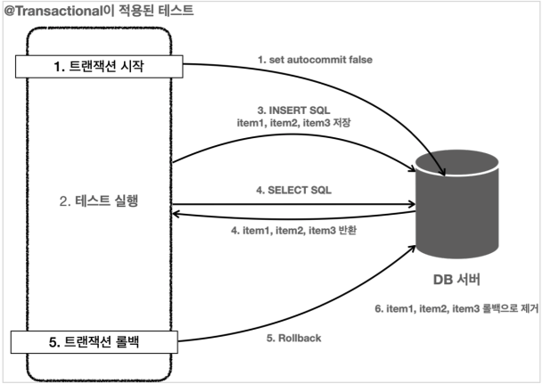

# 데이터 접근 기술 - 테스트

## 테스트 - 데이터베이스 연동

### test/application.properties

```properties
# PROFILE
spring.profiles.active = test

# DataSource
spring.datasource.url = jdbc:h2:tcp://localhost/~/test
spring.datasource.username = sa

# JdbcTemplate SQL Log
logging.level.org.springframework.jdbc = debug
```

## 테스트 - 데이터베이스 분리

### 분리

H2 데이터베이스를 용도에 따라 2가지로 구분하면 된다.

* `jdbc:h2:tcp://localhost/~/test`
    * local에서 접근하는 서버 전용 데이터베이스
* `jdbc:h2:tcp://localhost/~/testcase`
    * test 케이스에서 사용하는 전용 데이터베이스

#### Database 생성

* 데이터베이스 서버를 종료하고 다시 실행한다.
* 사용자명은 sa 입력
* JDBC URL에 다음 입력,
* `jdbc:h2:~/testcase` (최초 한번)
* `~/testcase.mv.db` 파일 생성 확인
* 이후부터는 `jdbc:h2:tcp://localhost/~/testcase` 이렇게 접속

#### test/application.properties 변경

```properties
# PROFILE
spring.profiles.active = test

# DataSource
spring.datasource.url = jdbc:h2:tcp://localhost/~/testcase
spring.datasource.username = sa
```

### 테스트 실행

* `findItems()` 테스트만 단독으로 실행해보자
* 처음에는 실행에 성공한다.
* 그런데 같은 `findItems()` 테스트를 다시 실행하면 테스트에 실패한다.

* 테스트를 2번째 실행할 때 실패하는 이유는 `testcase` 데이터베이스에 접속해서 item 테이블의 데이터를 확인하면 알 수 있다.
* 처음 테스트를 실행할 때 저장한 데이터가 계속 남아있기 때문에 두번째 테스트에 영향을 준 것이다.
* 이 문제는 save() 같은 다른 테스트가 먼저 실행되고 나서 findItems() 를 실행할 때도 나타난다.
    * 다른 테스트에서 이미 데이터를 추가했기 때문이다. 결과적으로 테스트 데이터가 오염된 것이다.
* 이 문제를 해결하려면 각각의 테스트가 끝날 때 마다 해당 테스트에서 추가한 데이터를 삭제해야 한다.
    * 그래야 다른 테스트에 영향을 주지 않는다.

#### 테스트의 중요한 원칙

* 테스트는 다른 테스트와 격리해야 한다.
* 테스트는 반복해서 실행할 수 있어야 한다.

물론 테스트가 끝날 때 마다 추가한 데이터에 DELETE SQL 을 사용해도 되겠지만, 이 방법도 궁극적인 해결책은 아니다.
만약 테스트 과정에서 데이터를 이미 추가했는데,
테스트가 실행되는 도중에 예외가 발생하거나 애플리케이션이 종료되어 버려서 테스트 종료 시점에 DELETE SQL 을 호출하지 못할 수 도 있다!
그러면 결국 데이터가 남아있게 된다.

## 테스트 - 데이터 롤백

### 트랜잭션과 롤백 전략

이때 도움이 되는 것이 바로 트랜잭션이다.

* 테스트가 끝나고 나서 트랜잭션을 강제로 롤백해버리면 데이터가 깔끔하게 제거된다.
* 테스트를 하면서 데이터를 이미 저장했는데, 중간에 테스트가 실패해서 롤백을 호출하지 못해도 괜찮다.
* 트랜잭션을 커밋하지 않았기 때문에 데이터베이스에 해당 데이터가 반영되지 않는다.
* 이렇게 트랜잭션을 활용하면 테스트가 끝나고 나서 데이터를 깔끔하게 원래 상태로 되돌릴 수 있다.
* 예를 들어서 다음 순서와 같이 각각의 테스트 실행 직전에 트랜잭션을 시작하고, 각각의 테스트 실행 직후에 트랜잭션을 롤백해야 한다.
* 그래야 다음 테스트에 데이터로 인한 영향을 주지 않는다.

```
1. 트랜잭션 시작
2. 테스트 A 실행
3. 트랜잭션 롤백

4. 트랜잭션 시작
5. 테스트 B 실행
6. 트랜잭션 롤백
```

테스트는 각각의 테스트 실행 전 후로 동작하는 @BeforeEach , @AfterEach 라는 편리한 기능을 제공한다.
테스트에 트랜잭션과 롤백을 적용하기 위해 다음 코드를 추가하자.

### 직접 트랜잭션 추가

```java
@SpringBootTest
public class ItemRepositoryTest {
    @Autowired
    PlatformTransactionManager transactionManager;
    TransactionStatus status;

    @Autowired
    private ItemRepository itemRepository;

    @BeforeEach
    void beforeEach() {
        // 트랜잭션 시작
        this.status = transactionManager.getTransaction(new DefaultTransactionDefinition());
    }

    @AfterEach
    void afterEach() {
        // 메모리 Repository 인 경우 제한적으로 사용
        if (this.itemRepository instanceof MemoryItemRepository) {
            ((MemoryItemRepository) this.itemRepository).clearStore();
        }

        // 트랜잭션 롤백
        this.transactionManager.rollback(status);
    }
    
    // ...
}
```

* 트랜잭션 관리자는 `PlatformTransactionManager`를 주입 받아서 사용하면 된다.
    * 참고로 스프링 부트는 자동으로 적절한 트랜잭션 매니저를 스프링 빈으로 등록해준다.
    * 앞서 학습한 스프링 부트의 자동 리소스 등록 장을 떠올려보자.
* `@BeforeEach`
    * 각각의 테스트 케이스를 실행하기 직전에 호출된다.
    * 따라서 여기서 트랜잭션을 시작하면 된다.
    * 그러면 각각의 테스트를 트랜잭션 범위 안에서 실행할 수 있다.
    * `transactionManager.getTransaction(new DefaultTransactionDefinition())`로 트랜잭션을 시작한다.
* `@AfterEach`
    * 각각의 테스트 케이스가 완료된 직후에 호출된다.
    * 따라서 여기서 트랜잭션을 롤백하면 된다.
    * 그러면 데이터를 트랜잭션 실행 전 상태로 복구할 수 있다.
    * `transactionManager.rollback(status)`로 트랜잭션을 롤백한다.

## 테스트 - @Transaction

### 테스트 코드 수정

```java
@Transactional
@SpringBootTest
public class ItemRepositoryTest {

    @Autowired
    private ItemRepository itemRepository;

    @AfterEach
    void afterEach() {
        // 메모리 Repository 인 경우 제한적으로 사용
        if (this.itemRepository instanceof MemoryItemRepository) {
            ((MemoryItemRepository) this.itemRepository).clearStore();
        }
    }
}
```

### @Transactional 원리

* 스프링이 제공하는 `@Transactional` 애노테이션은 로직이 성공적으로 수행되면 커밋하도록 동작한다.
* 그런데 `@Transactional` 애노테이션을 테스트에서 사용하면 아주 특별하게 동작한다.
* `@Transactional`이 테스트에 있으면 스프링은 테스트를 트랜잭션 안에서 실행하고, **테스트가 끝나면 트랜잭션을 자동으로 롤백시켜 버린다!**

#### 동작 방식



1. 테스트에 `@Transactional` 애노테이션이 테스트 메서드나 클래스에 있으면 먼저 트랜잭션을 시작한다.
2. 테스트를 로직을 실행한다. 테스트가 끝날 때 까지 모든 로직은 트랜잭션 안에서 수행된다.
    * 트래잭션은 기본적으로 전파되기 때문에, 리포지토리에서 사용하는 JdbcTemplate도 같은 트랜잭션을 사용한다.
3. 테스트 실행 중에 INSERT SQL을 사용해서 `item1`, `item2`, `item3`를 데이터베이스에 저장한다.
    * 물론 테스트가 리포지토리를 호출하고, 리포지토리는 JdbcTemplate을 사용해서 데이터를 저장한다.
4. 검증을 위해서 SELECT SQL로 데이터를 조회한다. 여기서는 앞서 저장한 `item1`, `item2`, `item3`이 조회되었다.
    * SELECT SQL도 같은 트랜잭션을 사용하기 때문에 저장한 데이터를 조회할 수 있다.
      다른 트랜잭션에서는 해당 데이터를 확인할 수 없다.
    * 여기서 `assertThat()`으로 검증이 모두 끝난다.
5. `@Transactional`이 테스트에 있으면 테스트가 끝날때 트랜잭션을 강제로 롤백한다.
6. 롤백에 의해 앞서 데이터베이스에 저장한 `item1`, `item2`, `item3`의 데이터가 제거된다.

> **참고**<br>
> 테스트 케이스의 메서드나 클래스에 `@Transactional`을 직접 붙여서 사용할 때만 이렇게 동작한다.
>
> 그리고 트랜잭션을 테스트에서 시작하기 때문에 서비스, 리포지토리에 있는 `@Transactional`도 테스트에서 시작한 트랜잭션에 참여한다.
>
> 이 부분은 뒤에 **트랜잭션 전파**에서 더 자세히 설명하겠다.
> 지금은 테스트에서 트랜잭션을 실행하면 테스트 실행이 종료될 때 까지 테스트가 실행하는 모든 코드가 같은 트랜잭션 범위에 들어간다고 이해하면 된다.
> 같은 범위라는 뜻은 쉽게 이야기해서 같은 트랜잭션을 사용한다는 뜻이다.
> 그리고 같은 트랜잭션을 사용한다는 것은 같은 커넥션을 사용한다는 뜻이기도 하다.

### 정리

* 테스트가 끝난 후 개발자가 직접 데이터를 삭제하지 않아도 되는 편리함을 제공한다.
* 테스트 실행 중에 데이터를 등록하고 중간에 테스트가 강제로 종료되어도 걱정이 없다.
    * 이 경우 트랜잭션을 커밋하지 않기 때문에, 데이터는 자동으로 롤백된다.
    * 보통 데이터베이스 커넥션이 끊어지면 자동으로 롤백되어 버린다.
* 트랜잭션 범위 안에서 테스트를 진행하기 때문에 동시에 다른 테스트가 진행되어도 서로 영향을 주지 않는 장점이 있다.
* `@Transactional`덕분에 아주 편리하게 다음 원칙을 지킬수 있게 되었다.
    * 테스트는 다른 테스트와 격리해야 한다.
    * 테스트는 반복해서 실행할 수 있어야 한다.

#### 강제로 커밋하기 - @Commit

```java
import org.springframework.test.annotation.Commit;

@Commit
@Transactional
@SpringBootTest
public class ItemRepositoryTest { ... }
```

`@Transactional`을 테스트에서 사용하면 테스트가 끝나면 바로 롤백되기 때문에 테스트 과정에서 저장한 모든 데이터가 사라진다.
당연히 이렇게 되어야 하지만, 정말 가끔은 데이터베이스에 데이터가 잘 보관되었는지 최종 결과를 눈으로 확인하고 싶을 때도 있다.
이럴 때는 다음과 같이 `@Commit`을 클래스 또는 메서드에 붙이면 테스트 종료후 롤백 대신 커밋이 호출된다.
참고로 `@Rollback(value = false)`를 사용해도 된다

## 테스트 - 임베디드 모드 DB

## 테스트 - 스프링 부트와 임베디드 모드