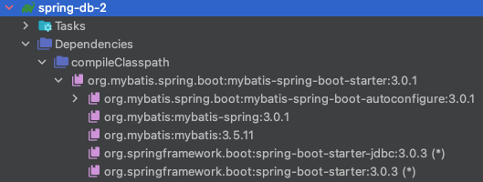
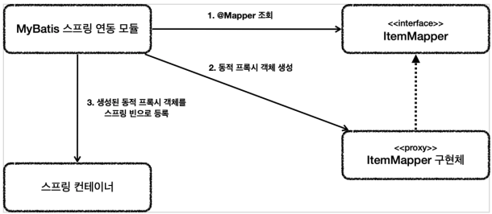

# 데이터 접근 기술 - MyBatis

## MyBatis 소개

### 소개

MyBatis는 앞서 설명한 JdbcTemplate보다 더 많은 기능을 제공하는 **SQL Mapper**이다.

* 기본적으로 JdbcTemplate이 제공하는 대부분의 기능을 제공한다.
* JdbcTemplate과 비교해서 MyBatis의 가장 매력적인 점
    * SQL을 **XML**에 편리하게 작성할 수 있다.
    * **동적 쿼리**를 매우 편리하게 작성할 수 있다.

### 비교 - 기본

#### JdbcTemplate

```java
String sql = "update item " +
        "set item_name=:itemName, price=:price, quantity=:quantity " +
        "where id=:id";
```

#### MyBatis

```xml
<update id="update">
    update item
    set item_name=#{itemName},
        price=#{price},
        quantity=#{quantity}
    where id = #{id}
</update>
```

MyBatis는 XML에 작성하기 때문에 라인이 길어져도 문자 더하기에 대한 불편함이 없다.

### 비교 - 동적 쿼리

#### JdbcTemplate

```java
String sql = "select id, item_name, price, quantity from item";
SqlParameterSource param = new BeanPropertySqlParameterSource(cond);

// 동적 쿼리
// 1. itemName 이나 maxPrice 에 값이 있는 경우
if (StringUtils.hasText(itemName) || maxPrice != null) {
    sql += " where";

    boolean andFlag = false;
    // 2. itemName 에 값이 있는 경우
    if (StringUtils.hasText(itemName)) {
        sql += " item_name like concat('%', :itemName, '%')";
        andFlag = true;
    }

    // 3. maxPrice 에 값이 있는 경우
    if (maxPrice != null) {
        // 3-1. itemName, maxPrice 둘 다 값이 있는 경우
        if (andFlag) {
            sql += " and";
        }
        sql += " price <= :maxPrice";
    }
}

// 4. 최종 sql 문 출력
log.info("sql = {}", sql);
return template.query(sql, param, itemRowMapper());
```

#### MyBatis

```xml
<select id="findAll" resultType="Item">
    select id, item_name, price, quantity
    from item
    <where>
        <if test="itemName != null and itemName != ''">
            and item_name like concat('%',#{itemName},'%')
        </if>
        <if test="maxPrice != null">
            and price &lt;= #{maxPrice}
        </if>
    </where>
</select>
```

JdbcTemplate은 자바 코드로 직접 동적 쿼리를 작성해야 한다.
반면에 MyBatis는 동적 쿼리를 매우 편리하게 작성할 수 있는 다양한 기능들을 제공해준다.

### 비교 - 설정

JdbcTemplate은 스프링에 내장된 기능이고, 별도의 설정없이 사용할 수 있다는 장점이 있다.
반면에 MyBatis는 약간의 설정이 필요하다.

### 정리

프로젝트에서 동적 쿼리와 복잡한 쿼리가 많다면 MyBatis를 사용하고, 단순한 쿼리들이 많으면 JdbcTemplate을 선택해서 사용하면 된다.
물론 둘을 함께 사용해도 된다. 하지만 MyBatis를 선택했다면 그것으로 충분할 것이다.

> **참고**<br>
> 강의에서는 MyBatis의 기능을 하나하나를 자세하게 다루지는 않는다.
> MyBatis를 왜 사용하는지, 그리고 주로 사용하는 기능 위주로 다룰 것이다.
> 그래도 이 강의를 듣고 나면 MyBatis로 개발을 할 수 있게 되고 추가로 필요한 내용을 공식 사이트에서 찾아서 사용할 수 있게 될 것이다.
>
> MyBatis는 기능도 단순하고 또 공식 사이트가 한글로 잘 번역되어 있어서 원하는 기능을 편리하게 찾아볼 수 있다.
> * [공식 사이트](https://mybatis.org/mybatis-3/ko/index.html)

## MyBatis 설정

### 설정

#### build.gradle

```gradle
dependencies {
    // MyBatis
    implementation 'org.mybatis.spring.boot:mybatis-spring-boot-starter:3.0.1'
}
```

다음과 같은 라이브러리가 추가된다.



* `mybatis-spring-boot-starter`
    * MyBatis를 스프링 부트에서 편리하게 사용할 수 있게 시작하는 라이브러리
* `mybatis-spring-boot-autoconfigure`
    * MyBatis와 스프링 부트 설정 라이브러리
* `mybatis-spring`
    * MyBatis와 스프링을 연동하는 라이브러리
* `mybatis`
    * MyBatis 라이브러리

#### application.properties

```properties
# MyBatis
mybatis.type-aliases-package = hello.springdb2.domain
mybatis.configuration.map-underscore-to-camel-case = true
logging.level.hello.springdb2.example.mybatis.repository = trace
```

> main, test 둘다 적용해주자!

* `mybatis.type-aliases-package`
    * 마이바티스에서 타입 정보를 사용할 때는 패키지 이름을 적어주어야 하는데, 여기에 명시하면 패키지 이름을 생략할 수 있다.
    * 지정한 패키지와 그 하위 패키지가 자동으로 인식된다.
    * 여러 위치를 지정하려면 `,`, `;` 로 구분하면 된다.
* `mybatis.configuration.map-underscore-to-camel-case = true`
    * JdbcTemplate의 `BeanPropertyRowMapper`에서 처럼 언더바를 카멜로 자동 변경해주는 기능을 활성화 한다.
    * 바로 다음에 설명하는 관례의 불일치 내용을 참고하자.
    * 기본값은 false이다.
* `logging.level.hello.itemservice.repository.mybatis = trace`
    * MyBatis에서 실행되는 쿼리 로그를 확인할 수 있다.

#### 관례의 불일치

자바 객체에는 주로 카멜(`camelCase`) 표기법을 사용한다.
`itemName`처럼 중간에 낙타 봉이 올라와 있는 표기법이다.

반면에 관계형 데이터베이스에서는 주로 언더스코어를 사용하는 `snake_case`표기법을 사용한다.
`item_name`처럼 중간에 언더스코어를 사용하는 표기법이다.

이렇게 관례로 많이 사용하다 보니 `map-underscore-to-camel-case` 기능을 활성화 하면 언더스코어 표기법을 카멜로 자동 변환해준다.
따라서 DB에서 `select item_name`으로 조회해도 객체의 `itemName ( setItemName() )` 속성에 값이 정상 입력된다.

정리하면 해당 옵션을 켜면 `snake_case`는 자동으로 해결되니 그냥 두면 되고,
컬럼 이름과 객체 이름이 완전히 다른 경우에는 조회 SQL에서 별칭을 사용하면 된다.

* 표기법 차이
    * DB: `select item_name`
    * 객체:  `name`
* 별칭을 통한 해결방안
    * `select item_name as name`

## MyBatis 적용 1 - 기본

### 예제

#### ItemMapper

```java
import org.apache.ibatis.annotations.Mapper;
import org.apache.ibatis.annotations.Param;

@Mapper
public interface ItemMapper {
    void save(Item item);

    void update(
            @Param("id") Long id,
            @Param("updateParam") ItemUpdateDto updateParam
    );

    List<Item> findAll(ItemSearchCond cond);

    Optional<Item> findById(Long id);
}
```

* 마이바티스 매핑 XML을 호출해주는 매퍼 인터페이스이다.
* 이 인터페이스에는 `@Mapper` 애노테이션을 붙여주어야 한다. 그래야 MyBatis에서 인식할 수 있다.
* 이 인터페이스의 메서드를 호출하면 다음에 보이는 `xml`의 해당 SQL을 실행하고 결과를 돌려준다.
* `ItemMapper` 인터페이스의 구현체에 대한 부분은 뒤에 별도로 설명한다.

#### ItemMapper.xml

```xml
<?xml version="1.0" encoding="UTF-8"?>
<!DOCTYPE mapper PUBLIC "-//mybatis.org//DTD Mapper 3.0//EN"
        "http://mybatis.org/dtd/mybatis-3-mapper.dtd">

<mapper namespace="hello.springdb2.example.mybatis.repository.ItemMapper">

    <insert id="save" useGeneratedKeys="true" keyProperty="id">
        insert into ITEM(ITEM_NAME, PRICE, QUANTITY)
        values (#{itemName}, #{price}, #{quantity})
    </insert>

    <update id="update">
        update ITEM
        set ITEM_NAME = #{updateParam.itemName},
            PRICE     = #{updateParam.price},
            QUANTITY  = #{updateParam.quantity}
        where ID = #{id}
    </update>

    <select id="findById" resultType="Item">
        select ID, ITEM_NAME, PRICE, QUANTITY
        from ITEM
        where ID = #{id}
    </select>

    <select id="findAll" resultType="Item">
        select ID, ITEM_NAME, PRICE, QUANTITY
        from ITEM
        <where>
            <if test="itemName != null and itemName != ''">
                and ITEM_NAME like concat('%', #{itemName}, '%')
            </if>
            <if test="maxPrice != null">
                <!-- price <= #{maxPrice} -->
                and price &lt;= #{maxPrice}
            </if>
        </where>
    </select>
    
</mapper>
```

* `namespace`: 앞서 만든 매퍼 인터페이스를 지정하면 된다.
* **주의!** 경로와 파일 이름에 주의하자.

> **참고 - XML 파일 경로 수정하기**<br>
> XML 파일을 원하는 위치에 두고 싶으면 `application.properties` 에 다음과 같이 설정하면 된다.
> * `mybatis.mapper-locations = classpath:mapper/**/*.xml`
>
> 이렇게 하면 `resources/mapper`를 포함한 그 하위 폴더에 있는 XML을 XML 매핑 파일로 인식한다.
> 이 경우 파일 이름은 자유롭게 설정해도 된다.
>
> 참고로 테스트의 `application.properties`파일도 함께 수정해야 테스트를 실행할 때 인식할 수 있다.

### 설명

#### Insert - save()

```xml
void save(Item item);

<insert id="save" useGeneratedKeys="true" keyProperty="id">
    insert into ITEM(ITEM_NAME, PRICE, QUANTITY)
    values (#{itemName}, #{price}, #{quantity})
</insert>
```

* Insert SQL은 `<insert>`를 사용하면 된다.
* id 에는 매퍼 인터페이스에 설정한 메서드 이름을 지정하면 된다.
    * 여기서는 메서드 이름이 `save()`이므로 save 로 지정하면 된다.
* 파라미터는 `#{}` 문법을 사용하면 된다.
    * 그리고 매퍼에서 넘긴 객체의 프로퍼티 이름을 적어주면 된다.
* #{} 문법을 사용하면 `PreparedStatement`를 사용한다.
    * JDBC의 `?` 를 치환한다 생각하면 된다.
* `useGeneratedKeys`는 데이터베이스가 키를 생성해 주는 `IDENTITY`전략일 때 사용한다.
    * `keyProperty`는 생성되는 키의 속성 이름을 지정한다.
    * Insert가 끝나면 item 객체의 **id 속성에 생성된 값이 입력**된다.

#### Update - update()

```xml
import org.apache.ibatis.annotations.Param;

void update(
        @Param("id") Long id,
        @Param("updateParam") ItemUpdateDto updateParam
);

<update id="update">
    update ITEM
    set ITEM_NAME = #{updateParam.itemName},
        PRICE     = #{updateParam.price},
        QUANTITY  = #{updateParam.quantity}
    where ID = #{id}
</update>
```

* Update SQL은 `<update>`를 사용하면 된다.
* 여기서는 파라미터가 `Long id`, `ItemUpdateDto updateParam`으로 2개이다.
    * 파라미터가 1개만 있으면 @Param 을 지정하지 않아도 되지만,
      파라미터가 2개 이상이면 @Param 으로 이름을 지정해서 파라미터를 구분해야 한다.

#### Select - findById()

```xml
Optional<Item> findById(Long id);

<select id="findById" resultType="Item">
    select ID, ITEM_NAME, PRICE, QUANTITY
    from ITEM
    where ID = #{id}
</select>
```

* Select SQL은 `<select>` 를 사용하면 된다.
* `resultType`은 반환 타입을 명시하면 된다.
    * 여기서는 결과를 `Item`객체에 매핑한다.
    * 앞서 `application.properties`에 속성을 지정한 덕분에 모든 패키지 명을 다 적지는 않아도 된다. 그렇지 않으면 모든 패키지 명을 다 적어야 한다.
        * `mybatis.type-aliasespackage = hello.itemservice.domain`
    * JdbcTemplate의 `BeanPropertyRowMapper`처럼 SELECT SQL의 결과를 편리하게 객체로 바로 변환해준다.
    * 속성을 지정한 덕분에 언더스코어를 카멜 표기법으로 자동으로 처리해준다. (`item_name` -> `itemName`)
        * `mybatis.configuration.map-underscore-to-camel-case = true`
* 자바 코드에서 반환 객체가 하나이면 `Item`, `Optional<Item>`과 같이 사용하면 된다.
    * 반환 객체가 하나 이상이면 컬렉션(`List`)을 사용하면 된다.

#### Select - findAll()

```xml
List<Item> findAll(ItemSearchCond cond);

<select id="findAll" resultType="Item">
    select ID, ITEM_NAME, PRICE, QUANTITY
    from ITEM
    <where>
        <if test="itemName != null and itemName != ''">
            and ITEM_NAME like concat('%', #{itemName}, '%')
        </if>
        <if test="maxPrice != null">
            <!-- price <= #{maxPrice} -->
            and price &lt;= #{maxPrice}
        </if>
    </where>
</select>
```

* Mybatis는 `<where>`, `<if>` 같은 동적 쿼리 문법을 통해 편리한 동적 쿼리를 지원한다.
* `<if>`는 해당 조건이 만족하면 구문을 추가한다.
* `<where>`은 적절하게 `where` 문장을 만들어준다.
    * 예제에서 `<if>`가 모두 실패하게 되면 SQL `where`를 만들지 않는다.
    * 예제에서 `<if>`가 하나라도 성공하면 처음 나타나는 `and`를 `where`로 **변환**해준다.

#### XML 특수 문자

```
<!-- price <= #{maxPrice} -->
and price &lt;= #{maxPrice}
```

```
* < : &lt;
* > : &gt;
* & : &amp;
```

여기에 보면 `<=`를 사용하지 않고 `&lt;=`를 사용한 것을 확인할 수 있다.
그 이유는 XML에서는 데이터 영역에 `<` , `>` 같은 특수 문자를 사용할 수 없기 때문이다.
이유는 간단한데, XML에서 TAG가 시작하거나 종료할 때 `<`, `>`와 같은 특수문자를 사용하기 때문이다.

#### XML CDATA 사용

```xml
<!-- and price &lt;= #{maxPrice} -->
<![CDATA[
    and price <= #{maxPrice}
]]>
```

이 구문 안에서는 XML TAG가 단순 문자로 인식되기 때문에 `<if>`, `<where>` 등이 적용되지 않는다.

## MyBatis 적용 2 - 설정과 실행

### 예제

#### MyBatisItemRepository

```java
@Repository
@RequiredArgsConstructor
public class MyBatisItemRepository implements ItemRepository {
    private final ItemMapper itemMapper;

    @Override
    public Item save(Item item) {
        itemMapper.save(item);
        return item;
    }

    @Override
    public void update(
            Long itemId,
            ItemUpdateDto updateParam
    ) {
        itemMapper.update(itemId, updateParam);
    }

    @Override
    public Optional<Item> findById(Long id) {
        return itemMapper.findById(id);
    }

    @Override
    public List<Item> findAll(ItemSearchCond cond) {
        return itemMapper.findAll(cond);
    }
}
```

* `MyBatisItemRepository`는 단순히 `ItemMapper`에 기능을 위임한다.

#### MyBatisConfig

```java
@Configuration
@RequiredArgsConstructor
public class MyBatisConfig {
    private final ItemMapper itemMapper;

    @Bean
    public ItemService itemService() {
        return new ItemServiceV1(itemRepository());
    }

    @Bean
    public ItemRepository itemRepository() {
        return new MyBatisItemRepository(itemMapper);
    }
}
```

* `MyBatisConfig`는 `ItemMapper`를 주입받고, 필요한 의존관계를 만든다.

#### MainApplication

```java
//@Import(JdbcTemplateV3Config.class)
@Import(MyBatisConfig.class)
@SpringBootApplication(scanBasePackages = "hello.springdb2.controller")
public class SpringDb2Application {

    public static void main(String[] args) {
        SpringApplication.run(SpringDb2Application.class, args);
    }

    @Bean
    @Profile("local")
    public TestDataInit testDataInit(
            ItemRepository itemRepository
    ) {
        return new TestDataInit(itemRepository);
    }
}
```

* `@Import(MyBatisConfig.class)`
    * 앞서 설정한 `MyBatisConfig.class`를 사용하도록 설정했다.

## MyBatis 적용 3 - 분석

### 분석

#### ItemMapper 인터페이스

```java
@Mapper
public interface ItemMapper {
    void save(Item item);

    void update(
            @Param("id") Long id,
            @Param("updateParam") ItemUpdateDto updateParam
    );

    List<Item> findAll(ItemSearchCond cond);

    Optional<Item> findById(Long id);
}
```

#### 원리



1. 애플리케이션 로딩 시점에 MyBatis 스프링 연동 모듈은 `@Mapper`가 붙어있는 인터페이스를 조사한다.
2. 해당 인터페이스가 발견되면 동적 프록시 기술을 사용해서 `ItemMapper` 인터페이스의 구현체를 만든다.
3. 생성된 구현체를 스프링 빈으로 등록한다.

### 프록시를 확인 해보자

#### MyBatisRepository

```java
@Slf4j
@Repository
@RequiredArgsConstructor
public class MyBatisItemRepository implements ItemRepository {
    private final ItemMapper itemMapper;

    @Override
    public Item save(Item item) {
        log.info("itemMapper class = {}", itemMapper.getClass());
        itemMapper.save(item);
        return item;
    }
}
```

#### 결과 로그

```
itemMapper class = class jdk.proxy2.$Proxy59
```

> **참고**<br>
> 동적 프록시 기술은 **스프링 핵심원리 - 고급편**에서 자세히 설명한다.

### 매퍼 구현체

* 마이바티스 스프링 연동 모듈이 만들어주는 `ItemMapper`의 구현체 덕분에 인터페이스 만으로 편리하게 XML의 데이터를 찾아서 호출할 수 있다.
* 원래 마이바티스를 사용하려면 더 번잡한 코드를 거쳐야 하는데, 이런 부분을 인터페이스 하나로 매우 깔끔하고 편리하게 사용할 수 있다.
* 매퍼 구현체는 예외 변환까지 처리해준다.
    * `MyBatis`에서 발생한 예외를 스프링 예외 추상화인 `DataAccessException`에 맞게 변환해서 반환해준다.
    * `JdbcTemplate`이 제공하는 예외 변환 기능을 여기서도 제공한다고 이해하면 된다.

### 정리

* 매퍼 구현체 덕분에 마이바티스를 스프링에 편리하게 통합해서 사용할 수 있다.
* 매퍼 구현체를 사용하면 스프링 예외 추상화도 함께 적용된다.
* 마이바티스 스프링 연동 모듈이 많은 부분을 자동으로 설정해주는데,
  데이터베이스 커넥션, 트랜잭션과 관련된 기능도 마이바티스와 함께 연동하고, 동기화해준다.

> **참고**<br>
> 마이바티스 스프링 연동 모듈이 자동으로 등록해주는 부분은 `MybatisAutoConfiguration` 클래스를 참고하자.

## MyBatis 기능 정리 1 - 동적 쿼리

MyBatis에서 자주 사용하는 주요 기능을 공식 메뉴얼이 제공하는 예제를 통해 간단히 정리해보자.

* MyBatis 공식 메뉴얼: https://mybatis.org/mybatis-3/ko/index.html
* MyBatis 스프링 공식 메뉴얼: https://mybatis.org/spring/ko/index.html

### 동적 SQL

마이바티스가 제공하는 최고의 기능이자 마이바티스를 사용하는 이유는 바로 동적 SQL 기능 때문이다.
동적 쿼리를 위해 제공되는 기능은 다음과 같다.

#### if

```xml
<select id="findActiveBlogWithTitleLike" resultType="Blog">
    SELECT * FROM BLOG
    WHERE state = ‘ACTIVE’
    <if test="title != null">
        AND title like #{title}
    </if>
</select>
```

* 해당 조건에 따라 값을 추가할지 말지 판단한다.
* 내부의 문법은 `OGNL`을 사용한다. 자세한 내용은 `OGNL`을 검색해보자.

#### choose, when, otherwise

```xml
<select id="findActiveBlogLike" resultType="Blog">
    SELECT * FROM BLOG WHERE state = ‘ACTIVE’
    <choose>
        <when test="title != null">
            AND title like #{title}
        </when>
        <when test="author != null and author.name != null">
            AND author_name like #{author.name}
        </when>
        <otherwise>
            AND featured = 1
        </otherwise>
    </choose>
</select>
```

* 자바의 `switch` 구문과 유사한 구문도 사용할 수 있다

#### trim

```xml
<trim prefix="WHERE" prefixOverrides="AND |OR ">
    ...
</trim>
```

#### where

```xml
<select id="findActiveBlogLike" resultType="Blog">
    SELECT * FROM BLOG
    <where>
        <if test="state != null">
             state = #{state}
        </if>
        <if test="title != null">
            AND title like #{title}
        </if>
        <if test="author != null and author.name != null">
            AND author_name like #{author.name}
        </if>
    </where>
</select>
```

* `<where>`는 문장이 없으면 `where`를 추가하지 않는다.
* 문장이 있으면 `where`를 추가한다. 만약 `and`가 먼저 시작된다면 `and`를 지운다.

#### foreach

```xml
<select id="selectPostIn" resultType="domain.blog.Post">
    SELECT *
    FROM POST P
    <where>
        <foreach item="item" index="index" collection="list"
                open="ID in (" separator="," close=")" nullable="true">
            #{item}
        </foreach>
    </where>
</select>
```

* 컬렉션을 반복 처리할 때 사용한다. `where in (1,2,3,4,5,6)`와 같은 문장을 쉽게 완성할 수 있다.
* 파라미터로 `List`를 전달하면 된다.

## MyBatis 기능 정리 2 - 기타 기능
