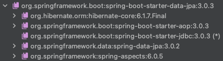

# 데이터 접근 기술 - JPA

## JPA 시작

### 소개

스프링과 JPA는 자바 엔터프라이즈(기업) 시장의 주력 기술이다.
스프링이 DI 컨테이너를 포함한 애플리케이션 전반의 다양한 기능을 제공한다면, JPA는 ORM 데이터 접근 기술을 제공한다.

#### 스프링 + 데이터 접근기술의 조합을 구글 트랜드로 비교했을 때

* 글로벌에서는 스프링 + JPA 조합을 80%이상 사용한다.
* 국내에서도 스프링 + JPA 조합을 50%정도 사용하고, 2015년 부터 점점 그 추세가 증가하고 있다.

JPA는 스프링 만큼이나 방대하고, 학습해야할 분량도 많다.
하지만 한번 배워두면 데이터 접근 기술에서 매우 큰 생산성 향상을 얻을 수 있다.
대표적으로 `JdbcTemplate`이나 `MyBatis`같은 SQL 매퍼 기술은 SQL을 개발자가 직접 작성해야 하지만, JPA를 사용하면 SQL도 JPA가 대신 작성하고 처리해준다.

실무에서는 JPA를 더욱 편리하게 사용하기 위해 스프링 데이터 `JPA`와 `Querydsl`이라는 기술을 함께 사용한다.
중요한 것은 JPA이다. 스프링 데이터 JPA, Querydsl은 JPA를 편리하게 사용하도록 도와주는 도구라 생각하면 된다.

이 강의에서는 모든 내용을 다루지 않고, JPA와 스프링 데이터 JPA, 그리고 Querydsl로 이어지는 전체 그림을 볼 것이다.
그리고 이 기술들을 우리 애플리케이션에 적용하면서 자연스럽게 왜 사용해야 하는지, 그리고 어떤 장점이 있는지 이해할 수 있게 된다.
이렇게 전체 그림을 보고 나면 앞으로 어떻게 공부해야 할지 쉽게 접근할 수 있을 것이다.

> **참고**<br>
> 각각의 기술들은 별도의 강의로 다룰 정도로 내용이 방대하다.
> 여기서는 해당 기술들의 기본 기능과, 왜 사용해야 하는지 각각의 장단점을 알아본다.
> 각 기술들의 자세한 내용은 다음 강의를 참고하자.
>
> * JPA - 자바 ORM 표준 JPA 프로그래밍 - 기본편
> * 스프링 데이터 JPA - 실전! 스프링 데이터 JPA
> * Querydsl - 실전! Querydsl

## ORM 개념 1 - SQL 중심적인 개발의 문제점

## ORM 개념 2 - JPA 소개

## JPA 설정

### 라이브러리 추가



#### build.gradle

```gradle
dependencies {
    // JAP, 스프링 데이터 JPA 추가
    implementation 'org.springframework.boot:spring-boot-starter-data-jpa'
}
```

* `hibernate-core`
    * JPA 구현체인 하이버네이트 라이브러리
* `jakarta.persistence-api`
    * JPA 인터페이스
* `spring-data-jpa`
    * 스프링 데이터 JPA 라이브러리
* `spring-boot-starter-jdbc`
    * 이전에 추가했던 JDBC 라이브러리도 함께 추가된다.
    * 이는 MyBatis도 동일하다.

#### application.properties

```properties
# JPA
logging.level.org.hibernate.SQL = debug
logging.level.org.hibernate.orm.jdbc.bind = trace
```

* `org.hibernate.SQL = debug`
    * 하이버네이트가 생성하고 실행하는 SQL을 확인할 수 있다.
* `org.hibernate.orm.jdbc.bind = trace`
    * SQL에 바인딩 되는 파라미터를 확인할 수 있다.
* `spring.jpa.show-sql = true`
    * 이 설정은 System.out 콘솔을 통해서 SQL이 출력된다. 따라서 이 설정은 권장하지는 않는다.

## JPA 적용 1 - 개발

### ORM 매핑

#### Item

```java
@Data
@Entity
@NoArgsConstructor
@Table(name = "item")
public class Item {
    @Id
    @GeneratedValue(strategy = GenerationType.IDENTITY)
    private Long id;

    @Column(name = "item_name", length = 10)
    private String itemName;
    private Integer price;
    private Integer quantity;
    
    // ...
}
```

* `@Entity`
    * JPA가 사용하는 객체라는 뜻이다.
    * 이 에노테이션이 있어야 JPA가 인식할 수 있다.
    * 이렇게 @Entity 가 붙은 객체를 JPA에서는 엔티티라 한다.
* `@Id`
    * 테이블의 PK와 해당 필드를 매핑한다.
    * `@GeneratedValue(strategy = GenerationType.IDENTITY)`
        * PK 생성 값을 데이터베이스에서 생성하는 `IDENTITY`방식을 사용한다.
        * 예) MySQL: `auto increment`
* `@Column`
    * 객체의 필드를 테이블의 컬럼과 매핑한다.
    * `name = "item_name"`
        * 객체는 itemName 이지만 테이블의 컬럼은 item_name 이므로 이렇게 매핑했다.
    * `length = 10`
        * JPA의 매핑 정보로 DDL(`create table`)도 생성할 수 있는데, 그때 컬럼의 길이 값으로 활용된다.
        * `varchar 10`
    * `@Column`을 생략할 경우 필드의 이름을 **테이블 컬럼 이름**으로 사용한다.
        * 참고로 지금처럼 스프링 부트와 통합해서 사용하면
          필드 이름을 테이블 컬럼 명으로 변경할 때 객체 필드의 **카멜 케이스를 테이블 컬럼의 언더스코어로 자동으로 변환**해준다.
            * itemName -> item_name
            * 따라서 위 예제의 `@Column(name = "item_name")`를 생략해도 된다.
* `@NoArgsConstructor`
    * JPA는 `public`또는 `protected`의 기본 생성자가 필수이다.
    * 기본 생성자를 꼭 넣어주자.
* `@Table(name = "item")`
    * 테이블을 지정해줄 수 있다.
    * 생략하면 해당 Class의 이름을 사용한다.

#### JpaItemRepository V1

```java
@Slf4j
@Repository
@Transactional
@RequiredArgsConstructor
public class JpaItemRepositoryV1 implements ItemRepository {
    private final EntityManager em;

    @Override
    public Item save(Item item) {
        this.em.persist(item);
        return item;
    }

    @Override
    public void update(
            Long itemId,
            ItemUpdateDto updateParam
    ) {
        Item findItem = em.find(Item.class, itemId);
        findItem.update(updateParam);
    }

    @Override
    public Optional<Item> findById(Long id) {
        Item item = em.find(Item.class, id);
        return Optional.ofNullable(item);
    }

    @Override
    public List<Item> findAll(ItemSearchCond cond) {
        String jpql = "select i from Item i";

        String itemName = cond.getItemName();
        Integer maxPrice = cond.getMaxPrice();

        if (StringUtils.hasText(itemName) || maxPrice != null) {
            jpql += " where";

            boolean andFlag = false;
            if (StringUtils.hasText(itemName)) {
                jpql += " i.itemName like concat('%', :itemName, '%')";
                andFlag = true;
            }

            if (maxPrice != null) {
                if (andFlag) {
                    jpql += " and";
                }
                jpql += " i.price <= :maxPrice";
            }
        }

        log.info("jpql = {}", jpql);

        TypedQuery<Item> query = em.createQuery(jpql, Item.class);
        if (StringUtils.hasText(itemName)) {
            query.setParameter("itemName", itemName);
        }
        if (maxPrice != null) {
            query.setParameter("maxPrice", maxPrice);
        }

        return query.getResultList();
    }
}
```

* `private final EntityManager em`
    * 생성자를 보면 스프링을 통해 엔티티 매니저(`EntityManager`)라는 것을 주입받은 것을 확인할 수 있다.
    * JPA의 모든 동작은 엔티티 매니저를 통해서 이루어진다.
    * 엔티티 매니저는 내부에 데이터소스를 가지고 있고, 데이터베이스에 접근할 수 있다.
* `@Transactional`
    * JPA의 모든 데이터 변경(등록, 수정, 삭제)은 트랜잭션 안에서 이루어져야 한다.
    * 조회는 트랜잭션이 없어도 가능하다.
    * 변경의 경우 일반적으로 서비스 계층에서 트랜잭션을 시작하기 때문에 문제가 없다.
    * 하지만 이번 예제에서는 복잡한 비즈니스 로직이 없어서 서비스 계층에서 트랜잭션을 걸지 않았다.
    * JPA에서는 데이터 변경시 트랜잭션이 필수다. 따라서 리포지토리에 트랜잭션을 걸어주었다.
* 다시한번 강조하지만 일반적으로는 비즈니스 로직을 시작하는 서비스 계층에 트랜잭션을 걸어주는 것이 맞다.

> **참고**<br>
> JPA를 설정하려면 `EntityManagerFactory`, JPA 트랜잭션 매니저(`JpaTransactionManager`), 데이터소스 등등 다양한 설정을 해야 한다.
> 스프링 부트는 이 과정을 모두 자동화 해준다.
> main() 메서드 부터 시작해서 JPA를 처음부터 어떻게 설정하는지는 JPA 기본편을 참고하자.
> 그리고 스프링 부트의 자동 설정은 `JpaBaseConfiguration`를 참고하자.

### 설정

#### JpaConfig

```java
@Configuration
@RequiredArgsConstructor
public class JpaConfig {
    private final EntityManager em;

    @Bean
    public ItemService itemService() {
        return new ItemServiceV1(itemRepository());
    }

    @Bean
    public ItemRepository itemRepository() {
        return new JpaItemRepositoryV1(em);
    }
}
```

#### MainApplication

```java
//@Import(MyBatisConfig.class)
@Import(JpaConfig.class)
@SpringBootApplication(scanBasePackages = "hello.springdb2.controller")
public class SpringDb2Application { ... }
```

## JPA 적용 2 - 리포지토리 분석

## JPA 적용 3 - 예외 변환
