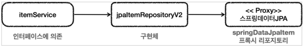

# 데이터 접근 기술 - 스프링 데이터 JPA

## 스프링 데이터 JPA 소개 1 - 등장 이유

## 스프링 데이터 JPA 소개 2 - 기능

## 스프링 데이터 JPA 주요 기능

스프링 데이터 JPA는 JPA를 편리하게 사용할 수 있도록 도와주는 라이브러리이다.
수많은 편리한 기능을 제공하지만 가장 대표적인 기능은 다음과 같다.

### 공통 인터페이스 기능


* `JpaRepository` 인터페이스를 통해서 기본적인 CRUD 기능을 제공한다.
* 공통화 가능한 기능이 거의 모두 포함되어 있다.
* `CrudRepository`에서 `fineOne()` -> `findById()` 로 변경되었다.

#### JpaRepository

```java
package org.springframework.data.jpa.repository;

@NoRepositoryBean
public interface JpaRepository<T, ID> 
            extends ListCrudRepository<T, ID>, ListPagingAndSortingRepository<T, ID>, QueryByExampleExecutor<T> { ... }
```

#### 사용법

```java
public interface ItemRepository extends JpaRepository<Item, Long> { }
```

* `JpaRepository` 인터페이스를 인터페이스 상속 받고, 제네릭에 관리할 `<엔티티, 엔티티ID>` 를 주면 된다.
* 그러면 `JpaRepository`가 제공하는 기본 CRUD 기능을 모두 사용할 수 있다.

#### 스프링 데이터 JPA가 구현 클래스를 대신 생성


* `JpaRepository`인터페이스만 상속받으면 스프링 데이터 JPA가 프록시 기술을 사용해서 구현 클래스를 만들어준다.
    * 그리고 만든 구현 클래스의 인스턴스를 만들어서 스프링 빈으로 등록한다.
* 따라서 개발자는 구현 클래스 없이 인터페이스만 만들면 기본 CRUD 기능을 사용할 수 있다.

### 쿼리 메서드 기능

스프링 데이터 JPA는 인터페이스에 메서드만 적어두면,
메서드 이름을 분석해서 쿼리를 자동으로 만들고 실행해주는 기능을 제공한다.

#### 순수 JPA 리포지토리

```java
public List<Member> findByUsernameAndAgeGreaterThan(String username, int age) {
    return em.createQuery("select m from Member m where m.username = :username and m.age > :age")
                .setParameter("username", username)
                .setParameter("age", age)
                .getResultList();
}
```

* 순수 JPA를 사용하면 직접 JPQL을 작성하고, 파라미터도 직접 바인딩 해야 한다.

#### 스프링 데이터 JPA

```java
public interface MemberRepository extends JpaRepository<Member, Long> {
    List<Member> findByUsernameAndAgeGreaterThan(String username, int age);
}
```

* 스프링 데이터 JPA는 메서드 이름을 분석해서 필요한 JPQL을 만들고 실행해준다.
    * 물론 JPQL은 JPA가 SQL로 번역해서 실행한다.
* 물론 그냥 아무 이름이나 사용하는 것은 아니고 다음과 같은 규칙을 따라야 한다.

#### 스프링 데이터 JPA가 제공하는 쿼리 메소드 기능

* [공식 Docs 1 - 키워드](https://docs.spring.io/spring-data/jpa/docs/current/reference/html/#jpa.query-methods.query-creation)
* [공식 Docs 2 - LIMIT](https://docs.spring.io/spring-data/jpa/docs/current/reference/html/#repositories.limit-query-result)

* 조회
    * `find…By` , `read…By` , `query…By` , `get…By`
    * 예:) `findHelloBy` 처럼 ...에 식별하기 위한 내용(설명)이 들어가도 된다.
* COUNT
    * `count…By` 반환타입 `long`
* EXISTS
    * `exists…By` 반환타입 `boolean`
* 삭제
    * `delete…By`, `remove…By` 반환타입 `long`
* DISTINCT
    * `findDistinct`, `findMemberDistinctBy`
* LIMIT
    * `findFirst3`, `findFirst`, `findTop`, `findTop3`

#### JPQL 직접 사용하기

```java
public interface SpringDataJpaItemRepository extends JpaRepository<Item, Long> {

    //쿼리 메서드 기능
    List<Item> findByItemNameLike(String itemName);
    
    //쿼리 직접 실행
    @Query("select i from Item i where i.itemName like :itemName and i.price <= :price")
    List<Item> findItems(@Param("itemName") String itemName, @Param("price") Integer price);
}
```

* 쿼리 메서드 기능 대신에 직접 JPQL을 사용하고 싶을 때는 @Query 와 함께 JPQL을 작성하면 된다.
    * 이때는 메서드 이름으로 실행하는 규칙은 무시된다.
* 참고로 스프링 데이터 JPA는 JPQL 뿐만 아니라 JPA의 네이티브 쿼리 기능도 지원한다.
    * JPQL 대신에 SQL을 직접 작성할 수 있다.

### 중요

> 스프링 데이터 JPA는 JPA를 편리하게 사용하도록 도와주는 도구이다.
> 따라서 JPA 자체를 잘 이해하는 것이 가장 중요하다.

## 스프링 데이터 JPA 적용 1

### 설정

#### build.gradle

```gradle
dependencies {
    // JPA, 스프링 데이터 JPA 추가
    implementation 'org.springframework.boot:spring-boot-starter-data-jpa'
}
```

### 예제

#### SpringDataJpaItemRepository

```java
public interface SpringDataJpaItemRepository extends JpaRepository<Item, Long> {

    // Item.itemName Like '%:itemName%'
    List<Item> findByItemNameLike(String itemName);

    // Item.price <= :price
    List<Item> findByPriceLessThanEqual(Integer price);

    // 쿼리 메서드 ( 아래 메서드와 동일한 기능 수행 )
    List<Item> findByItemNameLikeAndPriceLessThanEqual(String itemName, Integer price);

    // 쿼리 직접 실행
    @Query("select i from Item i where i.itemName like :itemName and i.price <= :price")
    List<Item> findItems(
            @Param("itemName") String itemName,
            @Param("price") Integer price
    );
}
```

* 스프링 데이터 JPA가 제공하는 `JpaRepository` 인터페이스를 인터페이스 상속 받으면 기본적인 CRUD 기능을 사용할 수 있다.
* 그런데 이름으로 검색하거나, 가격으로 검색하는 기능은 공통으로 제공할 수 있는 기능이 아니다.
    * 따라서 쿼리 메서드 기능을 사용하거나 `@Query`를 사용해서 직접 쿼리를 실행하면 된다.
* 동적 쿼리를 사용하면 좋겠지만, 스프링 데이터 JPA는 동적 쿼리에 약하다.
* 그리고 이 문제는 이후에 `Querydsl`에서 동적 쿼리로 깔끔하게 해결하겠다.

#### findAll()

* 코드에는 보이지 않지만 JpaRepository 공통 인터페이스가 제공하는 기능이다.
* 모든 Item 을 조회한다.
* JPQL: `select i from Item i`

#### findByItemNameLike()

* 이름 조건으로만 검색할 때 사용하는 쿼리 메서드이다.
* JPQL: `select i from Item i where i.name like ?`

#### findByPriceLessThanEqual()

* 가격 조건으로만 검색할 때 사용하는 쿼리 메서드이다.
* JPQL: `select i from Item i where i.price <= ?`

#### findByItemNameLikeAndPriceLessThanEqual()

* 이름과 가격 조건을 검색할 때 사용하는 쿼리 메서드이다.
* JPQL: `select i from Item i where i.itemName like ? and i.price <= ?`

#### findItems()

메서드 이름으로 쿼리를 실행하는 기능은 다음과 같은 단점이 있다.

1. 조건이 많으면 메서드 이름이 너무 길어진다.
2. 조인 같은 복잡한 조건을 사용할 수 없다.
    * 메서드 이름으로 쿼리를 실행하는 기능은 간단한 경우에는 매우 유용하지만,
      복잡해지면 직접 JPQL 쿼리를 작성하는 것이 좋다.

* 쿼리를 직접 실행하려면 `@Query` 애노테이션을 사용하면 된다.
* 쿼리를 직접 실행할 때는 파라미터를 명시적으로 바인딩 해야 한다.
    * 파라미터 바인딩은 `@Param("itemName")` 애노테이션을 사용하고, 애노테이션의 값에 파라미터 이름을 주면 된다.

## 스프링 데이터 JPA 적용 2

### JpaItemRepository V2

```java
@Repository
@Transactional
@RequiredArgsConstructor
public class JpaItemRepositoryV2 implements ItemRepository {

    private final SpringDataJpaItemRepository repository;

    @Override
    public Item save(Item item) {
        return repository.save(item);
    }

    @Override
    public void update(Long itemId, ItemUpdateDto updateParam) {
        Item findItem = repository.findById(itemId).orElseThrow();
        findItem.update(updateParam);
    }

    @Override
    public Optional<Item> findById(Long id) {
        return repository.findById(id);
    }

    @Override
    public List<Item> findAll(ItemSearchCond cond) {
        String itemName = cond.getItemName();
        Integer maxPrice = cond.getMaxPrice();

        if (StringUtils.hasText(itemName) && maxPrice != null) {
            return repository.findItems("%" + itemName + "%", maxPrice);
        } else if (StringUtils.hasText(itemName)) {
            return repository.findByItemNameLike("%" + itemName + "%");
        } else if (maxPrice != null) {
            return repository.findByPriceLessThanEqual(maxPrice);
        } else {
            return repository.findAll();
        }
    }
}
```

#### 의존관계와 구조

* `ItemService`는 `ItemRepository`에 의존하기 때문에 `ItemService`에서 `SpringDataJpaItemRepository`를 그대로 사용할 수 없다.
* 물론 `ItemService`가 `SpringDataJpaItemRepository`를 직접 사용하도록 코드를 고치면 되겠지만,
  우리는 `ItemService`코드의 변경없이 `ItemService`가 `ItemRepository`에 대한 의존을 유지하면서 DI를 통해 구현 기술을 변경하고 싶다.

#### 클래스 의존 관계


* `JpaItemRepositoryV2`는 `ItemRepository`를 구현한다.
* 그리고 `SpringDataJpaItemRepository`를 사용한다.

#### 런타임 의존 관계



* 런타임의 객체 의존관계는 다음과 같이 동작한다.
    * `itemService` -> `jpaItemRepositoryV2` -> `springDataJpaItemRepository(프록시 객체)`
* 이렇게 중간에서 `JpaItemRepository`가 어댑터 역할을 해준 덕분에
  `ItemService`가 사용하는 `ItemRepository` 인터페이스를 그대로 유지할 수 있고
  클라이언트인 `ItemService`의 코드를 변경하지 않아도 되는 장점이 있다.

### 설정

#### SpringDataJpaConfig

```java
@Configuration
@RequiredArgsConstructor
public class SpringDataJpaConfig {

    private final SpringDataJpaItemRepository springDataJpaItemRepository;

    @Bean
    public ItemService itemService() {
        return new ItemServiceV1(itemRepository());
    }

    @Bean
    public ItemRepository itemRepository() {
        return new JpaItemRepositoryV2(springDataJpaItemRepository);
    }
}
```

#### MainApplication

```java
@Import(SpringDataJpaConfig.class)
@SpringBootApplication(scanBasePackages = "hello.springdb2.controller")
public class SpringDb2Application { ... }
```

## 정리

* 스프링 데이터 JPA의 대표적인 기능을 알아보았다.
* 스프링 데이터 JPA는 이 외에도 정말 수 많은 편리한 기능을 제공한다.
    * 심지어 우리가 어렵게 사용하는 **페이징**을 위한 기능들도 제공한다.
* 스프링 데이터 JPA는 단순히 편리함을 넘어서 많은 개발자들이 똑같은 코드로 중복 개발하는 부분을 개선해준다.
* 개인적으로 스프링 데이터 JPA는 실무에서 기본으로 선택하는 기술이다.
* 스프링 데이터 JPA에 대한 자세한 내용은 **실전! 스프링 데이터 JPA 강의**를 참고하자.