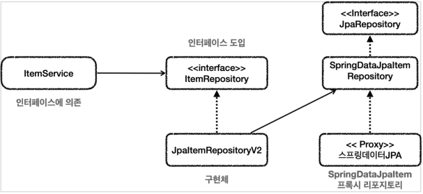
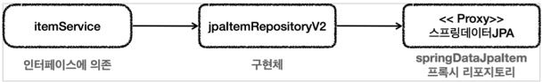
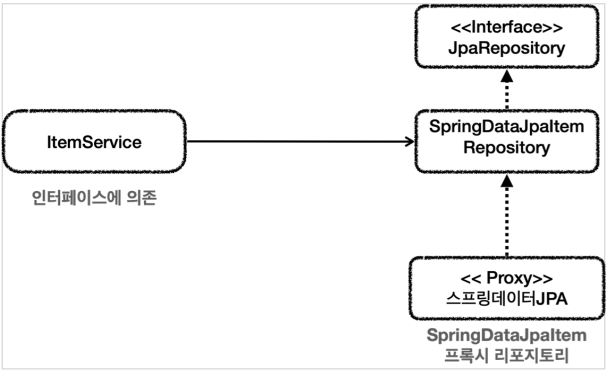
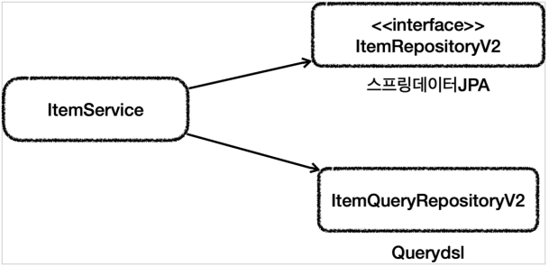

# 데이터 접근 기술 - 활용 방안

## 스프링 데이터 JPA 예제와 트레이드 오프

### 기존의 방법

#### 클래스 의존 관계



#### 런타임 객체 의존 관계



중간에서 `JpaItemRepositoryV2`가 어댑터 역할을 해준 덕분에
`ItemService`가 사용하는 `ItemRepository` 인터페이스를 그대로 유지할 수 있고
클라이언트인 `ItemService`의 코드를 변경하지 않아도 되는 장점이 있다.

#### 고민

* 구조를 맞추기 위해서, 중간에 어댑터가 들어가면서 전체 구조가 너무 복잡해지고 사용하는 클래스도 많아지는 단점이 생겼다.
* 실제 이 코드를 구현해야하는 개발자 입장에서 보면 중간에 어댑터도 만들고, 실제 코드까지 만들어야 하는 불편함이 생긴다.
* 유지보수 관점에서 `ItemService`를 변경하지 않고, `ItemRepository`의 구현체를 변경할 수 있는 장점이 있다.
* 그러니까 DI, OCP 원칙을 지킬 수 있다는 좋은 점이 분명히 있다.
* 하지만 반대로 구조가 복잡해지면서 어댑터 코드와 실제 코드까지 함께 유지보수 해야 하는 어려움도 발생한다.

### 다른 방법

#### 클래스 의존 관계



#### 런타임 객체 의존 관계


여기서 완전히 다른 선택을 할 수도 있다.
`ItemService` 코드를 일부 고쳐서 직접 스프링 데이터 JPA를 사용하는 방법이다.
DI, OCP 원칙을 포기하는 대신에, 복잡한 어댑터를 제거하고, 구조를 단순하게 가져갈 수 있는 장점이 있다.

### 트레이드 오프

이것이 바로 트레이드 오프다.

* DI, OCP를 지키기 위해 어댑터를 도입하고, 더 많은 코드를 유지한다.
* 어댑터를 제거하고 구조를 단순하게 가져가지만, DI, OCP를 포기하고, `ItemService` 코드를 직접 변경한다.

결국 여기서 발생하는 트레이드 오프는 **구조의 안정성 vs 단순한 구조와 개발의 편리성** 사이의 선택이다.
이 둘 중에 하나의 정답만 있을까? 그렇지 않다.
어떤 상황에서는 구조의 안정성이 매우 중요하고, 어떤 상황에서는 단순한 것이 더 나은 선택일 수 있다.

개발을 할 때는 항상 자원이 무한한 것이 아니다. 그리고 어설픈 추상화는 오히려 독이 되는 경우도 많다.
무엇보다 **추상화도 비용이 든다.** 인터페이스도 비용이 든다.
여기서 말하는 비용은 유지보수 관점에서 비용을 뜻한다.
이 추상화 비용을 넘어설 만큼 효과가 있을 때 추상화를 도입하는 것이 실용적이다.

이런 선택에서 하나의 정답이 있는 것은 아니지만, 프로젝트의 현재 상황에 맞는 더 적절한 선택지가 있다고 생각한다.
그리고 **현재 상황에 맞는 선택을 하는 개발자가 좋은 개발자라 생각한다.**

## 실용적인 구조

마지막에 Querydsl을 사용한 리포지토리는 스프링 데이터 JPA를 사용하지 않는 아쉬움이 있었다.
물론 Querydsl을 사용하는 리포지토리가 스프링 데이터 JPA 리포지토리를 사용하도록 해도 된다.

이번에는 스프링 데이터 JPA의 기능은 최대한 살리면서, Querydsl도 편리하게 사용할 수 있는 구조를 만들어보겠다.

### 복잡한 쿼리 분리



* `ItemRepositoryV2`는 스프링 데이터 JPA의 기능을 제공하는 리포지토리이다.
* `ItemQueryRepositoryV2`는 Querydsl을 사용해서 복잡한 쿼리 기능을 제공하는 리포지토리이다.
* 이렇게 둘을 분리하면 기본 CRUD와 단순 조회는 스프링 데이터 JPA가 담당하고, 복잡한 조회 쿼리는 Querydsl이 담당하게 된다.
* 물론 `ItemService`는 기존 `ItemRepository`를 사용할 수 없기 때문에 코드를 변경해야 한다.

### 예제

#### ItemRepositoryV2

```java
public interface ItemRepositoryV2 extends JpaRepository<Item, Long> { }
```

* `ItemRepositoryV2`는 `JpaRepository`를 인터페이스 상속 받아서 스프링 데이터 JPA의 기능을 제공하는 리포지토리가 된다.
* 기본 CRUD는 이 기능을 사용하면 된다.
* 여기에 추가로 단순한 조회 쿼리들을 추가해도 된다.

#### ItemQueryRepositoryV2

```java
@Repository
public class ItemQueryRepositoryV2 {
    private final JPAQueryFactory query;

    public ItemQueryRepositoryV2(EntityManager em) {
        this.query = new JPAQueryFactory(em);
    }

    public List<Item> findAll(ItemSearchCond cond) {
        return query.select(item)
                .from(item)
                .where(
                        maxPrice(cond.getMaxPrice()),
                        likeItemName(cond.getItemName())
                ).fetch();
    }

    private BooleanExpression likeItemName(String itemName) {
        if (StringUtils.hasText(itemName)) {
            return item.itemName.like("%" + itemName + "%");
        }
        return null;
    }

    private BooleanExpression maxPrice(Integer maxPrice) {
        if (maxPrice != null) {
            return item.price.loe(maxPrice);
        }
        return null;
    }
}
```

* ItemQueryRepositoryV2 는 Querydsl을 사용해서 복잡한 쿼리 문제를 해결한다.
* Querydsl을 사용한 쿼리 문제에 집중되어 있어서, 복잡한 쿼리는 이 부분만 유지보수 하면 되는 장점이 있다.

#### ItemService V2

```java
@Service
@RequiredArgsConstructor
@Transactional
public class ItemServiceV2 implements ItemService {
    private final ItemRepositoryV2 itemRepositoryV2;
    private final ItemQueryRepositoryV2 itemQueryRepositoryV2;

    @Override
    public Item save(ItemAddDto dto) {
        return itemRepositoryV2.save(new Item(
                dto.getItemName(), dto.getPrice(), dto.getQuantity()
        ));
    }

    @Override
    public void update(
            Long itemId,
            ItemUpdateDto updateParam
    ) {
        Item findItem = findById(itemId).orElseThrow();
        findItem.update(updateParam);
    }

    @Override
    public Optional<Item> findById(Long id) {
        return itemRepositoryV2.findById(id);
    }

    @Override
    public List<Item> findItems(ItemSearchCond cond) {
        return itemQueryRepositoryV2.findAll(cond);
    }
}
```

* `@Transactional`이 Repository에서 Service로 옮겨졌다.

#### V2Config

```java
@Configuration
@RequiredArgsConstructor
public class V2Config {
    private final EntityManager em;
    private final ItemRepositoryV2 itemRepositoryV2;

    @Bean
    public ItemService itemService() {
        return new ItemServiceV2(itemRepositoryV2, itemQueryRepository());
    }

    @Bean
    public ItemQueryRepositoryV2 itemQueryRepository() {
        return new ItemQueryRepositoryV2(em);
    }

    @Bean
    public ItemRepository itemRepository() {
        return new JpaItemRepositoryV3(em);
    }
}
```

#### MainApplication

```java
@Import(V2Config.class)
@SpringBootApplication(scanBasePackages = "hello.springdb2.controller")
public class SpringDb2Application { ... }
```

### 테스트는 다시 만들어야 한다..

테스트는 `ItemRepository`를 테스트 하는데, 현재 `JpaItemRepositoryV3`가 스프링 빈으로 등록되어 있다.
`V2Config`에서 사용한 리포지토리를 테스트 하려면 `ItemQueryRepositoryV2`, `ItemRepositoryV2`용 테스트가 별도로 필요하다.

> **참고**<br>
> 스프링 데이터 JPA가 제공하는 커스텀 리포지토리를 사용해도 비슷하게 문제를 해결할 수는 있다.

## 다양한 데이터 접근 기술 조합

## 정리